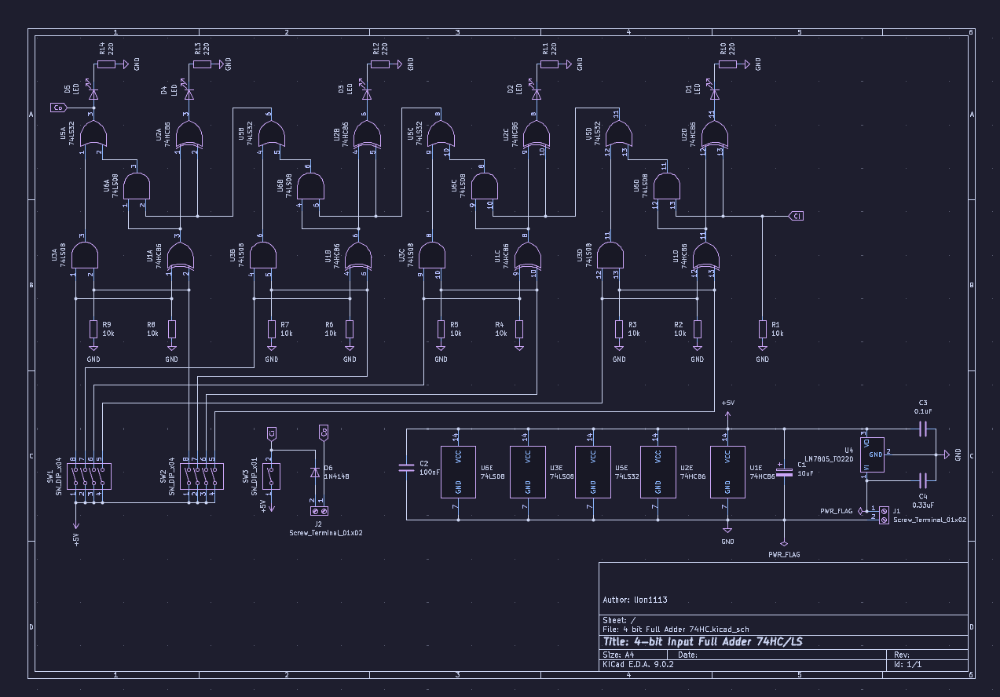
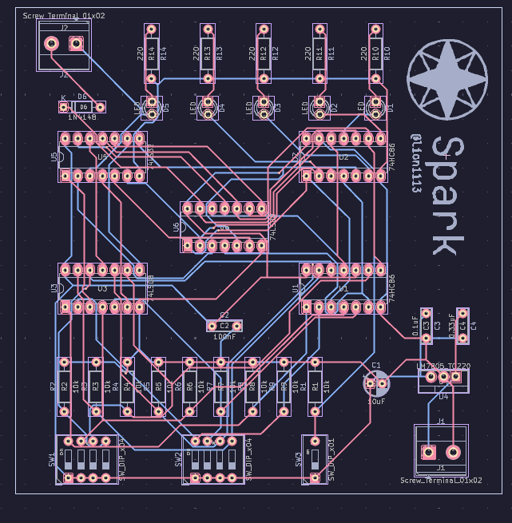

# 4 bit 74HC Full Adder

This is a 4 bit Adder, made to work with 74HC ICs. I made this as a school project. The project was made with KiCAD 9.0.
Thanks to @nbellotto who helped me along the way. 
I will not update this, but feel free to fork the repository and modify it to your liking, as long as you comply with the [license](./License)

